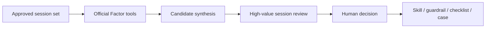

<h1 align="center">EvoZeus Session Signal</h1>

<p align="center"><strong>A review method and seven official Factor tools for finding high-value AI collaboration history.</strong></p>

<p align="center">
  <a href="https://github.com/MetaInFLow/EvoZeus-session-signal-skill/actions/workflows/ci.yml"></a>
  <a href="https://github.com/MetaInFLow/EvoZeus-session-signal-skill/releases/latest"></a>
  
</p>

<p align="center">
  Part of <a href="https://github.com/MetaInFLow/EvoZeus"><strong>EvoZeus</strong></a> ·
  <a href="#quick-start">Quick Start</a> · <a href="SKILL.md">Method</a> ·
  <a href="docs/guides/create-official-factor.md">Create a Factor</a>
</p>

EvoZeus Session Signal helps reviewers find the small number of sessions worth preserving, fixing, or turning into reusable Skills. Factor tools produce explainable signals and evidence references; [`SKILL.md`](SKILL.md) combines those signals into review candidates and keeps the final judgment human-auditable.



## Table of contents

- [Quick start](#quick-start)
- [How the method works](#how-the-method-works)
- [Official Factor tools](#official-factor-tools)
- [Factor input and result contract](#factor-input-and-result-contract)
- [Runtime integration](#runtime-integration)
- [Repository boundaries](#repository-boundaries)
- [Development](#development)
- [License](#license)

## Quick start

Install the Factor dependencies from a source checkout:

```console
$ python3 -m venv .venv
$ . .venv/bin/activate
$ python3 -m pip install -e ".[nlp]"
```

Validate the method and all seven Factor specs:

```console
$ python3 -m unittest discover -s tests
$ python3 scripts/validate_official_factor_spec.py factors/*/spec.json
```

Run approved local analysis through [EvoZeus Infra](https://github.com/MetaInFLow/EvoZeus-infra):

```console
$ evozeus-runtime session-insights \
    --workspace "$HOME" \
    --official-repo-root /absolute/path/to/EvoZeus-session-signal-skill
```

## How the method works

The method separates gating signals from diagnostic context:

1. **Active Factors** identify user correction, incomplete work, and repeated requests.
2. **Diagnostic Factors** explain tool friction, resource use, key sentences, and recurring intent.
3. **Candidate synthesis** assigns a review route such as success, problem, failure, repeat, workflow, or skip.
4. **Human review** confirms evidence and decides whether to preserve a Skill, guardrail, checklist, troubleshooting rule, or Case.

Routine completions with little reusable information should be skipped. Successful workflows and failure chains can both become high-value candidates when the evidence supports reuse.

## Official Factor tools

当前 official factors 覆盖：

| Factor | Lifecycle | Review contribution |
| --- | --- | --- |
| `user-input-sentiment` | Active | Finds dissatisfaction, corrections, and explicit problem reports |
| `task-completion` | Active | Separates complete, blocked, incomplete, and unknown outcomes |
| `repeated-request` | Active | Detects unresolved requests that recur in the same session |
| `tool-failure-frequency` | Diagnostic | Locates process friction and troubleshooting evidence |
| `session-resource-usage` | Diagnostic | Shows which tools, Skills, and MCP services supported the work |
| `key-sentence-trends` | Diagnostic | Extracts actions, objects, negations, and delivery statements |
| `semantic-phrase-clusters` | Diagnostic | Groups equivalent user requests into stable intent patterns |

These tools emit filterable signals rather than a universal score. MBTI-style profile output is a synthesis view and is not an official Factor.

## Factor Input and Result Contract

Every Factor unit is self-contained:

```text
factors/<factor-slug>/
  FACTOR.xml     # Human- and agent-readable contract
  factor.py      # Deterministic implementation
  spec.json      # Official metadata and test vectors
  session.json   # Redacted example input
```

An official spec declares:

- `stability: official`
- EvoZeus protocol compatibility
- governance owner
- `zh-CN` and `en-US` title and summary metadata
- deterministic, redacted test vectors

Factor results use shared targets, datasets, presentations, and `evidence_refs`. Presentation components fall back to built-in table or JSON views when a richer renderer is unavailable.

## Runtime integration

[EvoZeus Infra](https://github.com/MetaInFLow/EvoZeus-infra) owns scanning, execution, ledger writes, and report rendering. This repository supplies the method, implementations, schemas, examples, and report assets through an explicit source root pinned by the EvoZeus product manifest.

```text
EvoZeus product CLI
  -> EvoZeus Infra runtime
  -> this repository's SKILL.md and factors/
  -> local evidence ledger
  -> high-value session review report
```

See [Factor system concepts](docs/architecture/factor-system-concepts.md) and [Session Signal system design](docs/design/session-signal-skill-system-design.md).

## Repository boundaries

| This repository owns | Owned elsewhere |
| --- | --- |
| `SKILL.md` review method | Session scanning and runtime execution |
| `OfficialFactor` abstraction | Product channel manifests |
| Official Factor schema and tools | Release checksums, SBOM, and attestation |
| Redacted test vectors | Raw customer or private sessions |
| Report templates and review semantics | Final automated product scoring |

Public contributions must use synthetic or fully redacted evidence.

## Development

```console
$ python3 -m unittest discover -s tests
$ python3 scripts/validate_official_factor_spec.py factors/*/spec.json
$ git diff --check
```

New Factor tools should follow [the creation guide](docs/guides/create-official-factor.md) and include contract metadata, evidence references, test vectors, and regression tests. See [AGENTS.md](AGENTS.md) and [CHANGELOG.md](CHANGELOG.md).

## License

This repository does not currently declare a standalone software license. Contact the maintainers before external redistribution or reuse.
