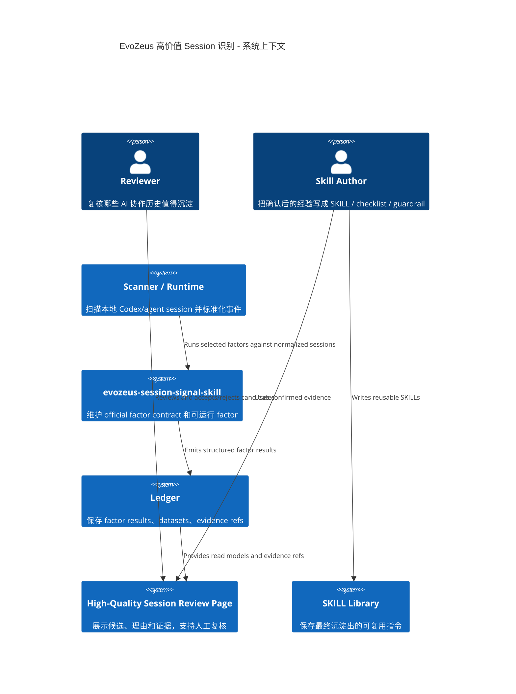
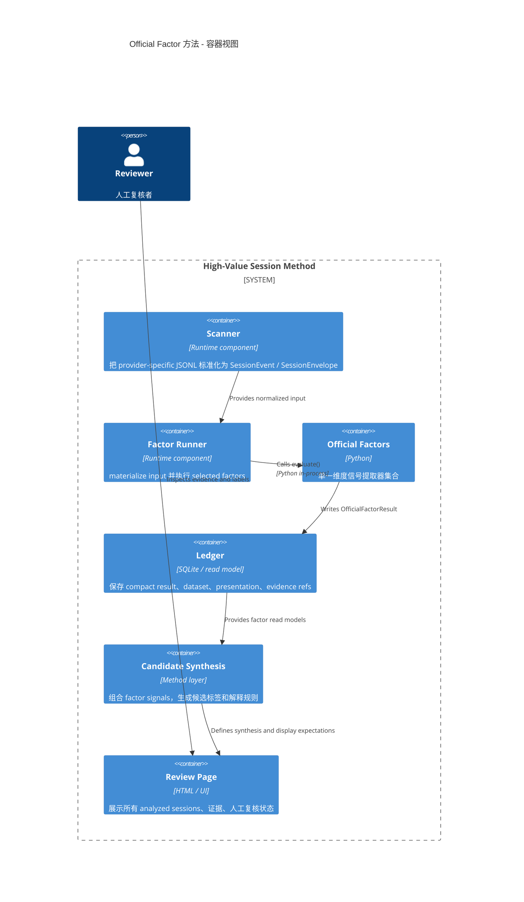
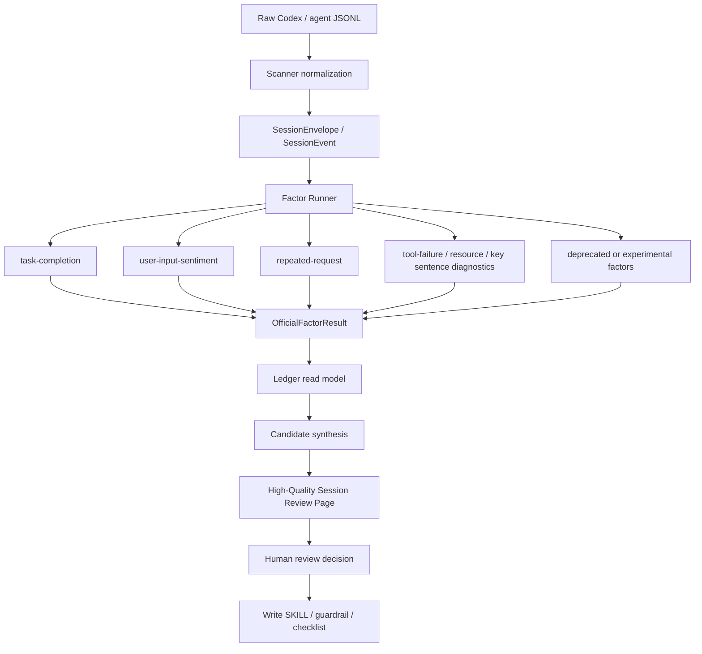

# EvoZeus Factor 系统概念梳理

- Status: draft
- Date: 2026-06-24
- Owner: EvoZeus factor contract
- Language: 中文为主，保留必要 English contract 名称

## 1. 一句话结论

`factor` 存在的原因是：**把混乱、长、隐私敏感的 AI 协作聊天记录，转成可运行、可复核、可组合的结构化信号**。

它不是最终评分，不是 SKILL 本身，也不是页面。它是“证据到判断”中间那层可校准的分析单元。

```text
raw chat
  -> scanner 标准化
  -> factor 抽取单一信号
  -> ledger 保存结构化结果
  -> candidate synthesis 合成判断
  -> review page 给人复核
  -> confirmed insight 再沉淀成 SKILL / guardrail / checklist
```

## 2. 为什么需要 Factor

如果直接让一个大模型读全部聊天并判断“哪些高价值”，会有几个问题：

1. **不可复现**：同一批聊天每次读出来的理由可能不同。
2. **不可校准**：不知道是哪类证据导致某条 session 被判高价值。
3. **不可追溯**：用户看不到具体是哪几句话、哪个工具失败、哪次重复请求支撑结论。
4. **隐私风险高**：容易把 raw chat 当成结果长期保存。
5. **难以组合**：任务完成、用户纠偏、工具失败、资源使用、关键句密度是不同维度，不能揉成一个黑盒分数。

所以需要 `factor`：

- 每个 factor 只负责一个稳定问题。
- 每个 factor 产出结构化 result、dataset、evidence refs。
- 上层再组合这些信号，而不是让 factor 直接决定最终价值。

## 3. Factor 是什么，不是什么

| 概念 | 是什么 | 不是什么 |
| --- | --- | --- |
| `factor` | 一个可运行的信号提取器，输入 normalized session/event，输出结构化结果。 | 最终评分模型、人工复核结论、SKILL 文档。 |
| `FACTOR.xml` | factor 的一等 contract，声明输入、输出、证据、展示建议、限制。 | 运行时代码、页面代码、业务 pack 发布 manifest。 |
| `factor.py` | factor 的 Python 实现，实现 `OfficialFactor.evaluate()`。 | scanner、runner、ledger、UI。 |
| `spec.json` | legacy validator 兼容用的官方 spec。 | 新的一等规范源。 |
| `OfficialFactorResult` | factor 唯一输出，包含 status、scores、statistics、datasets、presentations、evidence_refs。 | raw transcript、完整聊天归档。 |
| `dataset` | 可落账 read model，如 repeated chain、sentiment rows、tool failure distribution。 | 图表本身。 |
| `presentation` | 如何展示 dataset 的建议，如 table/bar/word cloud。 | React/Vue 前端组件实现。 |
| `evidence_ref` | 指回 session event/source line 的证据指针。 | 原文长期复制。 |

Factor 还有生命周期，不是所有 factor 都应该长期 active：

| 生命周期 | 含义 | 是否能单独驱动候选 |
| --- | --- | --- |
| `active` | 稳定、可解释、可测试的直接信号 | 可以 |
| `diagnostic` | 只能解释上下文或补充证据 | 不可以 |
| `deprecated` | 判断价值弱或误导性强，保留历史兼容 | 不可以 |
| `experimental` | lab 阶段信号 | 默认不可以 |

## 4. 整个系统各部分功能

### 4.1 System Context



### 4.2 Container / Responsibility View



## 5. 数据流和判断流



判断逻辑应分两层：

| 层 | 负责什么 | 不负责什么 |
| --- | --- | --- |
| Factor 层 | 抽取“这件事发生了吗”：完成、纠偏、重复、失败、资源、关键句。 | 不做最终高价值判断。 |
| Synthesis 层 | 组合多个 factor，判断是否值得人工复核或沉淀。 | 不重新实现 factor 算法，不隐藏证据。 |

## 6. 当前 7 个 Factor 的角色

### Active direct gates：可以直接影响候选结论

| Factor | 回答的问题 | 高价值含义 | 常见误用 |
| --- | --- | --- | --- |
| `task-completion` | 任务最终完成了吗？是 completed / blocked / not_completed / unknown？ | 失败、阻塞、未完成可以形成排障候选；完成可以支撑成功流程候选。 | 把中间进度话术误当 blocked；把早期工具失败覆盖最终完成。 |
| `user-input-sentiment` | 用户是否不满、纠错、报告问题或正向反馈？ | 纠偏和问题反馈可形成 guardrail / interaction rule。 | 只看负面关键词，不看上下文；把所有纠偏都自动判高价值。 |
| `repeated-request` | 用户是否重复同一个未解决请求？ | 重复链说明前一轮没有满足稳定意图，可沉淀澄清问题或验收 checklist。 | 把“继续/开始/ok”当重复请求；没有展示 first/repeat pair。 |

### Diagnostics：解释上下文，不单独制造高价值

| Factor | 回答的问题 | 正确用途 | 常见误用 |
| --- | --- | --- | --- |
| `tool-failure-frequency` | 哪些工具失败了，是否影响任务？ | 只有和未完成、阻塞或可复用环境规则叠加时，才辅助 failure / troubleshooting。 | 把 wrapper success 当命令成功；把已恢复失败仍当最终失败。 |
| `session-resource-usage` | 用了哪些 tool / skill / MCP / plugin / connector？ | 还原工作链路、依赖和资源是否真实使用。 | 因为工具多就判高价值。 |
| `key-sentence-trends` | 用户/助手/工具里有哪些关键行动、对象、否定、输出句？ | 解释 session 在做什么，辅助写 SKILL 触发条件和步骤。 | 因为关键句多就判 workflow candidate。 |

### Deprecated 候选：不应继续驱动判断

| Factor | 问题 | 建议 |
| --- | --- | --- |
| `usage-sentence-cloud` | 高频词云更像展示和粗粒度探索，判断精度弱，容易制造伪洞察。 | 从 candidate synthesis 中排除；保留为 report visualization 或 NLP helper。 |

## 7. Candidate Label、Page Label、Human Review 的区别

这三层必须分开，否则页面会越来越乱。

| 层 | 字段示例 | 谁产生 | 含义 |
| --- | --- | --- | --- |
| Factor signal | `task_completion=not_completed`、`repeated_request_count=1` | factor | 单一维度事实或近似事实。 |
| Candidate label | `repeat_skill_candidate`、`problem_skill_candidate` | candidate synthesis | 这段 session 可能适合沉淀成什么类型的 SKILL 经验。 |
| Page label | `high_quality_session` / `low_quality_session` | review page 合成 | 在本次分析范围内是否进入人工复核队列。 |
| Human review | `unreviewed` / `accepted` / `rejected` / `needs_more_evidence` | reviewer | 人最终确认或否定。 |

`high_quality_session` 不是“成功 session”。它的意思是：**值得人打开看，因为这里可能有可沉淀的经验或问题**。

## 8. 这个 Repo 的边界

`evozeus-session-signal-skill` 应该只负责：

1. `OfficialFactor` Python contract。
2. official factor spec schema。
3. `FACTOR.xml` contract。
4. 可运行 official factor 实现。
5. 脱敏 test vectors。
6. 说明 factor outputs 如何被 SKILL synthesis 使用。

不应该负责：

- 扫描本地所有 session 的 runtime。
- 长期 ledger schema / API。
- React/Vue visualization component 实现。
- 真实业务 factor pack 发布。
- release manifest、checksum、SBOM、attestation。
- 人工复核决策存储系统。

这些职责应该在 `evozeus-infra` / runtime / UI host / SKILL library 中解决。

## 9. 为什么现在会乱

当前混乱主要来自四个概念被揉在一起：

1. **factor signal 和最终高价值判断混在一起**  
   例如工具失败、关键句多、资源多本来是诊断，却被当成直接高价值。

2. **完成状态和过程摩擦混在一起**  
   一段 session 可以中间失败很多次，但最终完成；这不等于 failure candidate，除非失败过程本身有明确可复用排障规则。

3. **页面展示和 ledger 结果混在一起**  
   结果页可以合成 `high_quality_session`，但不应该覆盖或伪装 raw factor result。

4. **official repo 和 runtime/release repo 混在一起**  
   本 repo 维护 official contract 和 factors，不负责扫描、安装、发布、UI host。

## 10. 推荐的稳定概念模型

用下面这句话约束后续设计：

```text
Factor 只回答一个可复核信号；
SKILL method 组合信号形成候选；
Review Page 帮人确认候选；
真正沉淀的是人工确认后的经验，不是 factor 分数。
```

对应到当前项目：

| 问题 | 应该落在哪 |
| --- | --- |
| “如何判断用户是不是重复请求？” | `factors/repeated-request/FACTOR.xml` + `factor.py` |
| “重复请求是否足以进入高价值候选？” | `SKILL.md` synthesis rules |
| “这个 session 具体哪两句话重复？” | factor dataset + evidence refs + review page |
| “页面怎么展示 first/repeat pair？” | review page / UI host |
| “人确认这条确实值得沉淀吗？” | human review state |
| “沉淀成什么？” | SKILL / guardrail / checklist 文档 |

## 11. 后续收敛建议

1. 把 `SKILL.md` 保持短，只写 synthesis rules 和 review page 必需证据。
2. 把每个 factor 的误判、限制、输入 channel 写进 `FACTOR.xml/quality_notes`。
3. 把当前静态 HTML 结果页抽成可重复脚本，避免手工合成 JSON。
4. 给 candidate synthesis 单独做 meta-factor 或脚本测试，不要把逻辑散在页面里。
5. 页面默认显示 `factor signal -> candidate label -> page label -> human review` 四层，避免用户误以为 factor 直接给最终结论。
