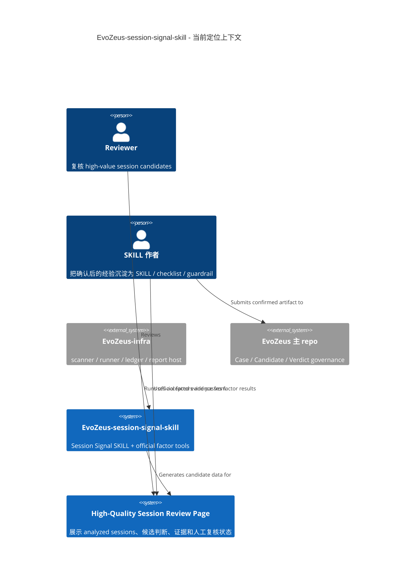
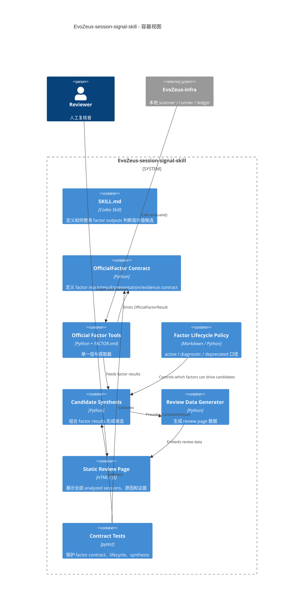

# EvoZeus Session Signal SKILL 当前定位设计

- 状态：修订版
- 日期：2026-06-24
- 范围：`EvoZeus-session-signal-skill` 当前 repo 的 Session Signal SKILL / official factor tools / review page 方法设计
- 依据：当前 `.gitmodules`、`00-global/repo-index.md`、本 repo `README.md` / `SKILL.md`

## 1. 刚刚检查到的事实

1. 当前 active submodule 只有 4 个：`evozeus`、`EvoZeus-session-signal-skill`、`EvoZeus-infra`、`EvoZeus-web`。
2. `EvoZeus-factor-lab` 已从 `.gitmodules` 移除，并在 `repo-index.md` 中标记为 removed from active mega repo submodules。
3. 本地仍残留 `10-repos/EvoZeus-factor-lab/` checkout，且它自己的 `SKILL.md` 有未提交改动；这是私有/内部历史实验仓，不应进入当前 active 规划。
4. `evozeus-community` 已重命名为 `EvoZeus-web`；旧名字只应作为历史域名或历史决策出现，不应作为当前 repo 名。
5. 本 repo 的当前定位不是五仓整体系统设计，而是：**识别高价值 AI 协作历史记录的 Session Signal SKILL + official factor tools**。
6. 当前 `README.md` 已把 `tool-failure-frequency` 定位为 diagnostic，但 `SKILL.md` 仍把它列为 direct gate；这是必须修的口径冲突。

## 2. 重新定位

`EvoZeus-session-signal-skill` 不是：

- EvoZeus 五仓总设计文档。
- runtime / scanner / ledger 的实现仓。
- factor-lab 的替代实验仓。
- official pack release / promotion queue。
- 最终评分模型。

它是：

```text
Session Signal SKILL
  + official factor tools
  + candidate synthesis rules
  + high-quality session review page method
```

一句话：本 repo 负责把真实 agent chat sessions 的 factor signals 转成可复核的 high-value session candidates，并解释为什么值得人工复核或沉淀。

## 3. 当前 Active Repo 边界

| Repo | 当前职责 | 与本 repo 的关系 |
| --- | --- | --- |
| `evozeus` | public protocol / governance / Case / Candidate / Verdict 语义 | 接收最终人工确认后的 Case、Candidate、SKILL / guardrail / checklist，不承接本 repo 的 factor 算法 |
| `EvoZeus-infra` | 本地 scanner / runner / ledger / report | 向本 repo 提供 normalized sessions / factor runner 环境；本 repo 不实现 scanner |
| `EvoZeus-session-signal-skill` | Session Signal SKILL + official factor tools + candidate synthesis | 当前设计主体 |
| `EvoZeus-web` | public-facing web surface / `/skill` 入口解释 | 只解释入口和路由，不执行判断，不收 raw evidence |

Removed / internal：

| Repo | 当前状态 | 规划处理 |
| --- | --- | --- |
| `EvoZeus-factor-lab` | private/internal，已从 active submodule 移除 | 不写入当前实施任务；只可作为历史参考或单独清理议题 |

## 4. 本 Repo 的核心对象

| 对象 | 产生者 | 用途 | 用户是否应看到 |
| --- | --- | --- | --- |
| `OfficialFactorResult` | `factors/<slug>/factor.py` | 单个 factor 的结构化信号 | 技术复核可看 |
| `CandidateResult` | candidate synthesis | 把多个 factor signal 合成候选类型、原因和排除项 | 应展示 |
| `ReviewPageRow` | review generator / page data | 列出每条 analyzed session 的标题、是否高价值、原因、证据入口 | 应展示 |
| `EvidenceSnippet` | scanner / evidence builder | 让用户能看懂这段聊天在讲什么 | 应展示短片段 |
| `HumanReviewState` | reviewer | `unreviewed` / `accepted` / `rejected` / `needs_more_evidence` | 应展示 |

不应作为本 repo 输出：

- raw transcript 全文。
- `.evozeus/runs/<run_id>/` 标准目录定义。
- web 页面文案。
- factor-lab lifecycle 实验样例。
- main repo 的 artifact taxonomy。

## 5. C4 Context



## 6. C4 Container



## 7. Factor 生命周期

Factor 不需要全部有用。生命周期是剪枝机制，不是失败羞辱。

| 生命周期 | 说明 | 能否单独驱动 high-quality | 当前建议 |
| --- | --- | --- | --- |
| `active` | 直接、稳定、可复核的候选信号 | 可以 | `task-completion`、`user-input-sentiment`、`repeated-request` |
| `diagnostic` | 解释上下文或增强原因 | 不可以 | `tool-failure-frequency`、`session-resource-usage`、`key-sentence-trends` |
| `deprecated` | 判断价值弱或误导性强 | 不可以 | `usage-sentence-cloud` 候选 |
| `experimental` | 未进入 official | 不属于当前 active repo 输出 | 不在当前 repo 新增 |
| `removed` | 已移除 | 不可以 | 只保留 changelog |

需要立即修正的口径：

- `tool-failure-frequency` 从 direct gate 移到 diagnostic。
- `usage-sentence-cloud` 不再进入 candidate synthesis，只保留为展示/探索或后续删除候选。

## 8. Candidate Synthesis 规则

Direct gates：

- `task-completion`
- `user-input-sentiment`
- `repeated-request`

Diagnostics：

- `tool-failure-frequency`
- `session-resource-usage`
- `key-sentence-trends`

Deprecated：

- `usage-sentence-cloud`

规则：

1. `repeated-request` 命中且有 first / repeat pair，形成 `repeat_skill_candidate`。
2. 用户明确纠偏、不满、问题反馈，形成 `problem_skill_candidate`。
3. 最终 `blocked` / `not_completed`，形成 `failure_skill_candidate`。
4. `tool-failure-frequency` 只有在未恢复、阻塞或可提炼环境规则时才增强 failure 解释，不能单独驱动。
5. 资源数量、关键句数量、词云频率不能单独形成 high-quality。
6. `completed` 且无 direct gate 时，默认 `not_skill_candidate`。
7. `high_quality_session` 只是人工复核候选，不是最终沉淀结论。

## 9. 用户可见产出物

本 repo 的用户可见产出物不是标准 runtime run artifact，而是 review method artifact。

| 产出物 | 价值 | 必须包含 |
| --- | --- | --- |
| `High-Quality Session Review Page` | 让用户能逐条看懂“这段聊天在讲什么、是否高价值、为什么” | 全部 analyzed sessions、high/low、原因、证据片段、factor 摘要、human review |
| `CandidateResult` JSON | 让结果可测试、可复跑、可被页面消费 | `session_id`、`candidate_label`、`page_label`、`reasons`、`excluded_factors` |
| `factor_result_reasons` | 解释高价值判断来自哪些 factor | factor id、signal、statistics、confidence、evidence refs |
| `excluded_factors` | 解释哪些 diagnostic/deprecated 信号被排除 | factor id、lifecycle、排除原因 |

## 10. 当前实施重点

1. 修正 `SKILL.md` 与 README 的 direct / diagnostic 口径冲突。
2. 为 official factors 增加 lifecycle policy。
3. 实现 `candidate_synthesis.py`，把页面判断逻辑从 HTML / 临时脚本中拿出来。
4. 重新生成 review data，让页面显示所有 analyzed sessions、原因和证据。
5. 从当前规划中移除 `EvoZeus-factor-lab` active 任务。
6. 保留对 `EvoZeus-infra` 的接口要求，但不在本 repo plan 中实现 infra run artifact。
